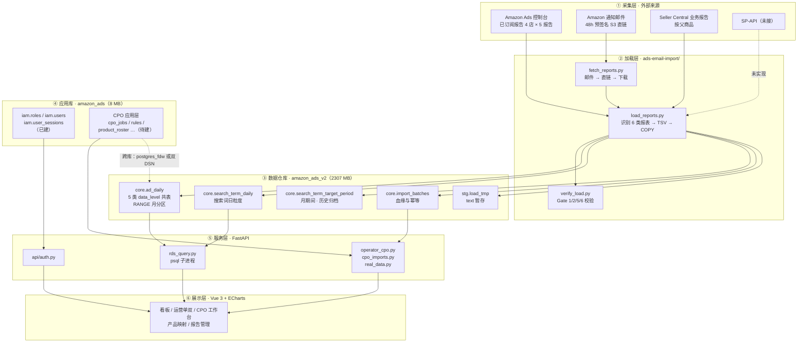
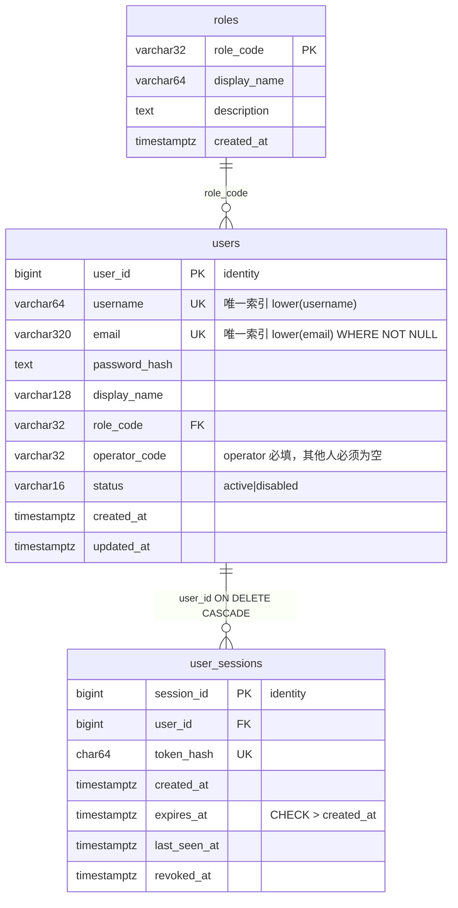
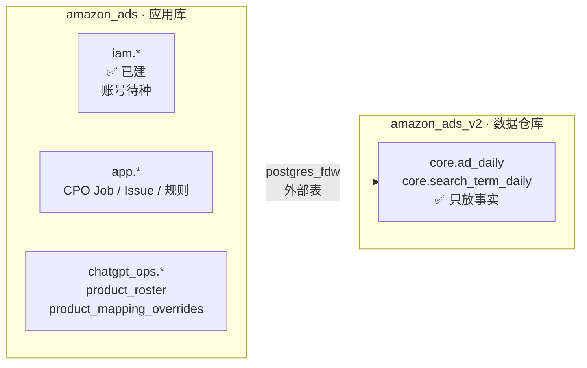

# AdSight 数据架构与 ER 图

> 生成日期：2026-09-15　|　**全部内容基于阿里云 RDS 实测**（`information_schema` + `pg_constraint` + `pg_indexes` + 行数统计），非设计稿推测。
> 实例：`pgm-bp1p3g11alay2d21vo.pg.rds.aliyuncs.com:5432` · PostgreSQL 18.4 · 时区 `Asia/Shanghai` · 账号 `amazon_ads_admin`
>
> 📄 **配套文档**：`五层分表设计与连接方案.md` —— 解释 5 个 `data_level` 之间的 NULL 成因、扇出关系、以及拆表后的建联方案（含可执行 DDL）。

---

## 一、总体分层架构



**关键约束**：PostgreSQL **不支持跨库 JOIN**。应用库 `amazon_ads` 与数据仓库 `amazon_ads_v2` 在同一实例上但互相不可见，打通只有两条路：

| 方案 | 做法 | 代价 |
|---|---|---|
| `postgres_fdw` | 在一侧建 foreign server + user mapping + 外部表 | 需维护两套凭证；`amazon_ads_admin` 实测**可 CREATE EXTENSION** |
| 应用层双 DSN | `auth` 走 `amazon_ads`，业务读走 `amazon_ads_v2`，JOIN 在 Python 做 | 改动小；跨库聚合要落在代码里 |

---

## 二、ER 图 ① — `amazon_ads_v2`（数据仓库）

```mermaid
erDiagram
    import_batches ||--o{ search_term_target_period : "source_batch_id"
    import_batches ||..o{ ad_daily : "batch_id（未建 FK，仅逻辑关联）"
    import_batches ||..o{ search_term_daily : "batch_id（未建 FK，仅逻辑关联）"

    import_batches {
        bigint batch_id PK "identity"
        text file_name "原始文件名"
        char64 file_hash UK "幂等锚点"
        text source_path
        text report_type
        date report_start_date
        date report_end_date
        timestamptz exported_at
        timestamptz imported_at
        int source_row_count
        int valid_row_count
        int failed_row_count
        text import_status "processing|success|partial|failed"
        text error_message
        jsonb metadata
        text account_id "后补列"
        text account_name
        text source_kind
        text source_url
        text data_level
        text target_table
        int inserted_row_count
        int updated_row_count
        int skipped_row_count
        text schema_version "默认 v2.0"
    }

    ad_daily {
        text account_id PK "复合主键 1/8"
        text ad_product PK "2/8 如 Sponsored Brands"
        text data_level PK "3/8 五类之一"
        text grain_level PK "4/8 campaign|ad_group"
        text campaign_id PK "5/8"
        text ad_group_id PK "6/8 默认空串"
        date stat_date PK "7/8 RANGE 分区键"
        text dimension_key PK "8/8 层内维度键"
        text account_name
        text manager_account "全空"
        text portfolio_id
        text portfolio_name
        text campaign_name
        text campaign_state
        text global_campaign_id
        text ad_group_name
        text budget_currency
        text placement "placement 层：3 个取值"
        text target_id "targeting 层"
        text target_text
        text target_match_type "BROAD|EXACT|PHRASE|TARGETING_EXPRESSION"
        numeric target_bid
        text target_type
        text target_status
        text advertised_product_id "实测 0/2457 填充"
        text advertised_product_name
        text advertised_product_parent_id
        text advertised_product_brand
        text advertised_product_category
        text advertised_product_subcategory
        text advertised_product_group
        text advertised_product_sku "实测 30/2457 填充"
        text advertised_product_marketplace
        text purchased_product_id "purchased_product 层"
        text purchased_product_name
        text purchased_product_marketplace
        bigint impressions
        bigint viewable_impressions
        bigint clicks
        numeric spend
        bigint purchases
        numeric sales
        bigint units
        bigint promoted_purchases
        numeric promoted_sales
        bigint promoted_units
        bigint halo_purchases
        numeric halo_sales
        bigint halo_units
        bigint new_to_brand_purchases
        numeric new_to_brand_sales
        bigint new_to_brand_units
        numeric long_term_sales
        bigint detail_page_views
        numeric ctr_pct
        numeric vctr_pct
        numeric cpc
        numeric cvr_pct
        numeric cpa
        numeric acos_pct
        numeric roas
        numeric promoted_cpa
        numeric promoted_cvr_pct
        numeric promoted_acos_pct
        numeric promoted_roas
        numeric new_to_brand_cpa
        numeric new_to_brand_cvr_pct
        numeric new_to_brand_acos_pct
        numeric new_to_brand_roas
        numeric long_term_roas
        numeric cost_per_detail_page_view
        numeric detail_page_view_rate_pct
        char64 row_hash "行级去重"
        bigint batch_id
        text source_file_name
        char64 source_file_hash
        timestamptz first_imported_at
        timestamptz updated_at
    }

    search_term_daily {
        text account_id PK
        text ad_product PK "实测全为空串"
        text campaign_id PK
        text ad_group_id PK
        text search_term PK "空串=非搜索来源行"
        date stat_date PK
        text account_name
        text portfolio_id
        text portfolio_name
        text campaign_name
        text ad_group_name
        text budget_currency
        bigint impressions
        bigint clicks
        numeric spend
        bigint purchases
        numeric sales
        bigint units
        bigint promoted_purchases
        numeric promoted_sales
        bigint promoted_units
        bigint halo_purchases
        numeric halo_sales
        bigint halo_units
        bigint new_to_brand_purchases
        numeric new_to_brand_sales
        bigint new_to_brand_units
        bigint detail_page_views
        numeric ctr_pct
        numeric cpc
        numeric cvr_pct
        numeric cpa
        numeric acos_pct
        numeric roas
        char64 row_hash
        bigint batch_id
        text source_file_name
        char64 source_file_hash
        timestamptz first_imported_at
        timestamptz updated_at
    }

    search_term_target_period {
        bigint period_fact_id PK "identity"
        text account_id
        text account_name
        text campaign_id
        text campaign_name
        text global_campaign_id
        numeric campaign_budget_amount
        text campaign_budget_type
        text campaign_state
        text campaign_start_raw
        text bidding_strategy
        numeric campaign_rule_amount
        text campaign_cost_type
        text budget_currency
        text delivery_id "历史空列"
        text delivery_name "历史空列"
        text delivery_start_raw
        text delivery_end_raw
        numeric delivery_budget "历史空列"
        text ad_group_id
        text ad_group_name
        text ad_id
        text ad_name
        text search_term
        text target_id
        numeric target_bid
        text target_type
        text target_state
        text target_text
        text target_match_type
        text placement
        text raw_date_range "原始区间文本"
        date period_start "月期间起"
        date period_end "月期间止"
        numeric cpm
        numeric cpc
        bigint impressions
        bigint viewable_impressions
        bigint clicks
        numeric ctr_pct
        numeric vctr_pct
        numeric spend
        bigint purchases
        bigint new_to_brand_purchases
        numeric cost_per_purchase
        numeric cost_per_new_to_brand_purchase
        numeric sales
        numeric long_term_sales
        numeric roas
        numeric long_term_roas
        int source_row_number
        char64 row_business_hash
        char64 row_content_hash
        bigint source_batch_id FK
        text source_file_name
        char64 source_file_hash
        timestamptz imported_at
    }
```



### `core.ad_daily` 的物理设计

| 项 | 值 |
|---|---|
| 类型 | `PARTITION BY RANGE (stat_date)` |
| 分区 | `ad_daily_2026_08` / `_09` / `_10` / `_11` / `ad_daily_default` |
| 主键 | `(account_id, ad_product, data_level, grain_level, campaign_id, ad_group_id, stat_date, dimension_key)` |
| 索引 | `idx_ad_daily_camp(account_id, campaign_id, stat_date)`、`idx_ad_daily_main(account_id, data_level, stat_date, campaign_id)`、`idx_ad_daily_prod(account_id, advertised_product_id)` |
| 自动扩分区 | `core.ensure_ad_daily_partition(p_date date)` |

### 五个 data_level 的语义与实测形态

| data_level | grain_level | 行数 | `dimension_key` 形态 | 唯一键数 | 备注 |
|---|---|---:|---|---:|---|
| `campaign` | campaign | 2,397 | `campaign`（常量） | 1 | 广告活动层 |
| `placement` | ad_group | 6,829 | `placement:<广告位>` | 3 | Top of Search / Product Pages / Rest of Search |
| `targeting` | ad_group | 62,021 | `target:<target_id>` | 3,268 | 投放定向层 |
| `advertised_product` | ad_group | 2,457 | `advprod:<ASIN>` | **1（退化）** | ⚠️ ASIN 列源数据为空，见下节 |
| `purchased_product` | ad_group | 16,097 | `purchased:<ASIN>` | 3,695 | ✅ 唯一可用的 ASIN 维度 |

> ⚠️ **聚合红线**：五个 data_level 是同一事实的不同切面，**禁止跨层相加**。做"总花费"只能用其中一层。

---

## 三、ER 图 ② — `amazon_ads`（应用库）



**角色枚举（`iam.roles` 实测 3 行）**

| role_code | display_name | description | operator_code |
|---|---|---|---|
| `super_admin` | 超级管理员 | 系统级账号与身份管理 | 必须为空 |
| `management` | 管理层 | 老板与运营主管同一层级 | 必须为空 |
| `operator` | 运营 | 各运营个人账号 | 必填 |

**实测状态**：`iam.users` = **0 行**，`iam.user_sessions` = **0 行** → 表建好了，**一个账号都没种**。且**没有 `iam.schema_migrations` 表**，说明是手写 SQL 落的，没有可追溯的迁移历史。

---

## 四、当前数据覆盖矩阵（实测）

| 账户 | 账户 ID | `ad_daily` | `search_term_daily` | `search_term_target_period` |
|---|---|---:|---:|---:|
| **anac1973 (C3S8S)** | `…95u2uh57eqgxov6ga8j0l0xlz` | 89,801<br/>2026-08-15~09-13 | 102,761<br/>2026-08-15~09-13 | — |
| **WHITIN** | `…42jh8psyvhiiiitpm4rnj4qhh` | — | — | 1,564,100<br/>2024-07-01~2025-09-30 |
| 欧德思 BLOOMNEXT | `…dfa7o7cwdl371d634ew58i919` | — | — | — |
| 洁博利 / AMS 其他 | — | — | — | — |

⚠️ **两个待澄清的命名陷阱**：

1. 桌面 `报销单/川鹏广告活动报告/` 里的 6 份报表**文件名全写「川鹏」，但内部 `广告主账户` 全是 `anac1973 (C3S8S)`**。数据库 `account_name` 忠实记录了 `anac1973 (C3S8S)` —— 文件夹名在撒谎，不是入库在撒谎。
2. `ads-email-import/raw/川鹏_推广的商品_30D_日期.csv`（**247 MB**）的账户才是真正的 WHITIN `…42jh8`，但**它没有入库**（`ad_daily` 里查无此账户）。另有一个同名 1.3 MB 文件在桌面，账户是 anac1973。

→ 结论：**日粒度广告数据目前只有 anac1973 一个账户入库**；月粒度的历史搜索词数据只有 WHITIN 一个账户入库。

---

## 五、导入批次血缘（`core.import_batches` 共 20 批，全 success）

| batch_id | data_level | 目标表 | source_rows | inserted | 期间 |
|---:|---|---|---:|---:|---|
| 1 | — | `search_term_target_period` | 4,242 | 0 | 2024-07（残月） |
| 34–46 | — | `search_term_target_period` | 99,903 … 150,277 | 0 | 2024-08 ~ 2025-09（**缺 2024-11**） |
| 51 | campaign | `ad_daily` | 2,397 | 2,397 | 2026-08-15 ~ 09-13 |
| 52 | placement | `ad_daily` | 6,829 | 6,829 | 同上 |
| 53 | targeting | `ad_daily` | 62,021 | 62,021 | 同上 |
| 54 | advertised_product | `ad_daily` | 2,649 | 2,457 | 同上（去重 192） |
| 55 | purchased_product | `ad_daily` | 16,097 | 16,097 | 同上 |
| 56 | search_term | `search_term_daily` | 102,761 | 102,761 | 同上 |

幂等机制：
- **文件级**：`file_hash` 唯一约束（SHA-256 of raw bytes）
- **行级**：`search_term_target_period` 的 `UNIQUE(source_batch_id, row_content_hash)`；`ad_daily` / `search_term_daily` 走主键 + `ON CONFLICT DO UPDATE`
- **坑**：失败批次若留 `import_status='processing'`，`file_hash` 会挡住重试 → 需先清理非 `success` 的同 hash 批次

---

## 六、已知数据质量缺口（实测，按严重度）

| # | 问题 | 证据 | 影响 | 严重度 |
|---|---|---|---|---|
| 1 | `ad_daily.advertised_product` 的 **ASIN 维度不可用** | `advertised_product_id` **0/2,457**；`dimension_key` 恒为 `advprod:`（唯一键数=1）；`advertised_product_sku` 仅 30/2,457 | 无法"按投放的 ASIN"聚合广告花费，只能退到 `purchased_product` 层 | 🔴 |
| 2 | `search_term_daily.ad_product` **全为空串** | 102,761/102,761 为空 | 搜索词数据无法按 SP/SB/SD 大类切分 | 🔴 |
| 3 | 日粒度数据**只覆盖 1 个账户** | `ad_daily` 仅 `…95u2uh…` | 多店看板做不了横向对比 | 🔴 |
| 4 | 控制台后端引用的 **12 个对象两库皆无** | `to_regclass` 全 false | `/api/reports`、`/dashboard/overview`、`/operator-cpo` 线上 500 | 🔴 |
| 5 | `manager_account` 全空 | 0/89,801 | 管理账户维度不可用 | 🟡 |
| 6 | `search_term_target_period` **缺 2024-11** | 批次 34–46 跳过该月 | 历史趋势断点 | 🟡 |
| 7 | `ad_daily`/`search_term_daily` 的 `batch_id` **无外键约束** | `pg_constraint` 中仅有 PK | 血缘链可断 | 🟢 |

### 问题 1 的根因（已查到底）

不是加载器的 bug —— **源报表 `推广的商品编号` 列本身就是空的**：
在桌面 `川鹏_推广的商品_30D_日期.csv` 中逐行统计 → **2,649 行全部为空，唯一 ASIN 数 = 0**。
即 Amazon 该账户（Sponsored Brands）的「推广的商品」报表不产出 ASIN 级归因。
→ 想按 ASIN 聚合，只能走 `purchased_product` 层（3,695 个 ASIN）或 `search_term_daily`。
→ 另注：表头 `推广的商品 SKU-Advertised product SKU` 带英文后缀，加载器 `build_col_index()` 已用 `h.split("-")[0]` 做了兜底，这条**不是** bug。

### 问题 4 的对象清单（控制台代码引用 / 库里不存在）

`core.subscribed_campaign_daily`、`core.subscribed_product_daily`、`core.subscribed_product_cpo_daily`、`core.subscribed_search_term_daily`、`core.subscribed_placement_daily`、`core.business_report_parent_asin_period`、`core.operator_name_mapping`、`core.product_alias`、`core.import_batch`（**单数**）、`analytics.v_campaign_daily_product_resolved`、`chatgpt_ops.product_roster`、`chatgpt_ops.product_mapping_overrides`

---

## 七、目标态（待用户确认后实施）



**分工原则**

| 库 | 放什么 | 不放什么 |
|---|---|---|
| `amazon_ads` | `iam.*` 身份与角色、CPO 应用层（job/issue/规则）、人工维护层（`chatgpt_ops.*`） | 原始广告事实 |
| `amazon_ads_v2` | 全部广告活动事实（`core.*`）与导入血缘 | 业务规则、用户、状态机 |

**待决策三项**

1. `analytics` / `chatgpt_ops` schema 是否在应用库重建？CPO 应用层建在 `amazon_ads` 的哪个 schema（`app` 还是沿用 `chatgpt_ops`）？
2. 跨库走 `postgres_fdw` 还是应用层双 DSN？
3. `account_name = anac1973 (C3S8S)` 这批数据，业务上到底算「川鹏2号」还是「AMS」？

---

## 八、复核命令

```bash
export PGPASSWORD=$(grep -oE 'amazon_ads_admin:[^@]+' \
  /Users/panjinlong/Documents/agent-master/amazon-ads-console/backend/.env | cut -d: -f2)
export PGSSLMODE=verify-full PGSSLROOTCERT=~/.postgresql/root.crt
H=pgm-bp1p3g11alay2d21vo.pg.rds.aliyuncs.com

# 两库对象总览
psql -w -h $H -U amazon_ads_admin -d amazon_ads    -c '\dt *.*'
psql -w -h $H -U amazon_ads_admin -d amazon_ads_v2 -c '\dt *.*'

# ad_daily 各 data_level 分布
psql -w -h $H -U amazon_ads_admin -d amazon_ads_v2 -c \
 "SELECT data_level, grain_level, count(*), count(DISTINCT dimension_key)
  FROM core.ad_daily GROUP BY 1,2 ORDER BY 3 DESC;"

# 通配方式拉出 core 全部 DDL
pg_dump -h $H -U amazon_ads_admin -d amazon_ads_v2 --schema-only --schema=core
```
