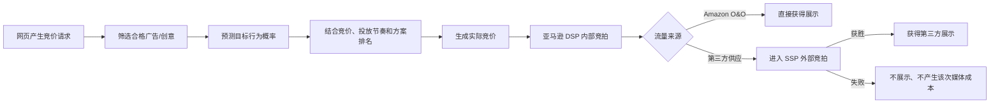

# 亚马逊DSP模型预测竞价与程序化竞拍逻辑

> [!summary] 摘要
> 亚马逊 DSP 会先按定向、素材、供应来源和频次等条件筛选可参与的广告，再预测一次展示实现目标 KPI 的可能性，用竞价优化模型结合基础/最高竞价、预算投放节奏和竞价方案生成排名及实际竞价。亚马逊自有自营流量在内部竞拍胜出后即可展示；第三方流量还需与其他 DSP 在 SSP 外部竞拍中竞争。

## 核心知识

### “模型预测控制”

课程明确描述的是“模型预测的行为 + 竞价优化模型 + 实时反馈优化”，但没有公开证明它采用控制理论中严格定义的 Model Predictive Control（MPC）算法。因此，最准确的理解是：

- 预测模型估计一次展示带来目标行为的可能性；
- 竞价优化模型把预测结果转成该次展示的竞价和排名权重；
- 预算投放、基础/最高竞价、定向和频次构成约束；
- 曝光、点击和转化结果经 ASIN 或像素回传，继续影响后续预测和优化。

### 人工设置与系统自动控制的对应关系

| DSP 设置 | 控制逻辑中的作用 | 实际含义 |
|---|---|---|
| Goal / Goal KPI | 优化目标 | 告诉系统优先追求点击、转化、触达、频次或其他目标 |
| ASIN / 转化像素 | 反馈传感器 | 判断展示后是否发生目标行为，为模型提供训练和归因信号 |
| 竞价方案 | 目标函数偏好 | 决定更优先保证预算投放，还是更优先追求绩效 |
| 基础广告流量资源竞价 | 竞价起点 | 绩效和投放修饰符的起始竞价；“尽可能提升效果”时是主导因素 |
| 最高广告流量资源竞价 | 竞价上限 | 最终竞价不可超过该值；“用完预算并尽可能提升效果”时是主导因素 |
| 自动竞价优化 | 控制器 | 根据每次展示的预测价值实时调整竞价 |
| 自动预算优化 | 预算分配器 | 在订单项之间调整预算，兼顾投放节奏和目标绩效 |
| 定向、供应来源、频次上限 | 准入门 | 在预测和竞价前淘汰不符合条件的展示机会 |

### 官方术语

- **DSP**：帮助广告主自动化购买广告流量资源的需求方平台，属于竞拍购买方。
- **SSP**：帮助出版商自动化销售广告流量资源的供应方平台，属于竞拍销售方。
- **竞价请求**：用户加载含广告位的页面时，系统生成并发送的展示机会信息。
- **竞拍购买**：一种无保证购买；提交竞价不保证获胜，展示机会通过实时竞价获得。
- **模型预测的行为**：对某次展示带来转化的可能性的估计。
- **竞价优化模型**：自动调整展示竞价，使流量更可能改善所选目标 KPI 的算法。
- **竞价方案**：决定亚马逊广告如何对广告和竞价进行排名；侧重投放和侧重绩效的方案都会使用模型预测结果。
- **基础竞价**：广告主提供、可修改的初始竞价，是效果和投放修饰符的起点。
- **最高竞价**：最终竞价的硬上限，任何效果或投放修饰都不能使竞价超过它。

### 一次展示的 1–8 步竞价周期

1. **竞价请求**：页面加载广告位，事件信息传递给亚马逊 DSP。
2. **竞价考虑对象**：找出尺寸、格式、创意、定向、供应来源和最高竞价等条件均合格的广告/创意组合。
3. **已筛选**：淘汰不符合订单项营销条件、供应来源、频次上限或其他设置的广告。
4. **已接受**：其余广告进入下一阶段。
5. **排名**：根据广告主竞价、模型预测的行为，以及适用时的投放安排得分，对可投放广告排序；系统随后生成实际竞价值。
6. **赢得内部竞拍**：排名第一的广告成为亚马逊 DSP 内部竞拍胜出方。
7. **自有自营流量展示**：若广告位属于 Amazon O&O，内部竞拍胜出即获得展示。
8. **第三方流量展示**：若来自第三方，内部胜出方还要进入 SSP 外部竞拍，与其他需求方竞价；SSP 还可能按商品品类等规则再次筛选，只有外部竞拍获胜才展示。

### 预测如何变成竞价

课程没有公开精确公式，可以用以下概念模型理解，但不能把它当成亚马逊官方算法：

$$
\text{展示价值} \approx P(\text{目标行为}\mid\text{用户、广告位、创意、时间等信号}) \times \text{目标行为价值}
$$

$$
\text{最终竞价} = \min(\text{最高竞价},\ \text{基础竞价经绩效、投放节奏和供应因素修正后的结果})
$$

同一广告面对不同用户、广告位或时间，预测概率不同，最终竞价也会不同。系统不是只判断“这个人会不会买”，而是在大量不确定的展示机会中比较“本次展示相对于目标 KPI 值多少钱”。

### 案例：以点击和 CPC 为目标

假设一个鞋类订单选择“与广告互动”，目标 KPI 为 CPC，广告主愿意为一次有效点击支付约 `$1.20`，最高 CPM 竞价设为 `$10`。

| 展示机会 | 模型预测点击率 | 概念上的展示价值 | 系统倾向 |
|---|---:|---:|---|
| A：近期浏览过相似鞋、版位可见性高 | 0.8% | `$1.20 × 0.8% × 1000 = $9.60 CPM` | 可在上限内积极竞价 |
| B：受众相关性弱、版位质量一般 | 0.1% | `$1.20 × 0.1% × 1000 = $1.20 CPM` | 低价参与或放弃 |
| C：相关性高但超过频次上限 | 即使预测较高也无效 | 在筛选阶段被淘汰 | 不参与竞价 |

这里的 `$9.60` 和 `$1.20` 只用于说明概率如何转化为经济价值，并非亚马逊公开公式。真实模型还会纳入预算节奏、创意、设备、供应来源、历史赢得率、清算价格和竞拍类型等信号。

若 A 对应的广告在亚马逊 DSP 内部排名第一：

- Amazon O&O 广告位：内部胜出后直接展示；
- 第三方广告位：携带生成的竞价进入 SSP 外部竞拍；
- 第一价格竞拍：若最终提交 `$7.10` 并获胜，通常支付 `$7.10`；
- 第二价格竞拍：若提交 `$7.10`、第二高价为 `$6.50`，按课程规则支付 `$6.51`；
- 第一价格环境下，竞价遮蔽会参考历史赢得率、清算价格、竞拍类型和供应方信息，尽量避免用明显高于必要水平的价格获胜。

### 两种竞价方案的差异

| 方案 | 第一优先级 | 主导竞价字段 | 典型结果 |
|---|---|---|---|
| 使用全部预算的同时，尽可能提升效果 | 预算投放，其次绩效 | 最高竞价 | 为保证投放，系统可覆盖更宽的展示机会，但仍受最高竞价限制 |
| 尽可能提升效果 | 绩效 | 基础竞价 | 更挑选高预测价值机会，可能无法花完预算，需要监控竞价与投放量 |

> [!warning] 不要把“花不完预算”简单理解为模型失效
> 预算未花完可能来自最高/基础竞价过低、定向过窄、频次上限、素材不合格、供应不足、目标 KPI 过严或转化信号不足。应先判断广告在竞价周期的哪一层被阻断。

### 什么是像素关联

“像素”不是图片中的像素点，而是部署在广告主网站或 App 中的转化追踪代码或事件标签。**像素关联**是指在 DSP 广告活动中选择与本次目标相对应的像素事件，让系统知道哪一种站外行为应当被视为广告成功。

以引流到品牌独立站的 DSP 广告为例：

1. 用户看到或点击 DSP 广告；
2. 用户进入品牌独立站；
3. 用户完成浏览商品、加入购物车、提交表单或购买；
4. 对应事件的像素触发；
5. Amazon DSP 在适用的归因规则下记录该事件，并把它作为报表和模型优化信号。

常见事件包括：

| 像素事件 | 代表的行为 | 适合的广告目标 |
|---|---|---|
| Page View / Product View | 访问网站或商品页面 | 访问量、落地页浏览 |
| Add to Cart | 加入购物车 | 深层互动、购买意向 |
| Lead / Registration | 提交线索或注册 | 获客、线索收集 |
| Purchase | 完成购买 | 销售、转化或 ROAS |

如果广告目标是购买，却只关联了 Page View，系统就可能把“能带来访问的人”误当成最优人群，而不是寻找“更可能购买的人”。因此，像素事件必须与 Goal KPI 保持一致。

#### ASIN 关联与像素关联

| 销售场景 | 应关联的对象 | 主要用途 |
|---|---|---|
| 商品在 Amazon 站内销售 | 对应 ASIN | 识别广告带来的站内商品行为和购买结果 |
| 广告链出到品牌独立站或 App | 对应转化像素 | 识别站外浏览、注册、加购和购买等行为 |
| 同一营销计划同时覆盖站内与站外目标 | 根据广告活动分别关联 ASIN 和相应像素 | 避免把不同转化目标混在同一优化信号中 |

两种目的地和反馈方式的完整区别见 [[亚马逊DSP链入与链出广告活动逻辑]]。

从控制逻辑看：

- Goal KPI 告诉系统“要优化什么”；
- ASIN 或像素告诉系统“什么结果算成功”；
- 竞价优化模型根据成功与失败的反馈，判断下一次展示值多少钱。

> [!warning] 像素关联错误的影响
> 未关联像素、关联错误事件或关联其他业务的像素，可能造成转化漏报、错误归因和模型反馈偏差。上线前应检查事件是否正常触发、事件名称和目标是否一致、是否选择了正确广告主/网站的像素，并遵守适用的隐私、Cookie 同意和数据处理要求。

### 设置与诊断检查

上线前应同时确认：

1. 已关联正确的 ASIN 和/或转化像素；
2. 已选择所需目标 KPI；
3. 自动优化中已启用竞价优化模型；
4. 自动优化中已启用预算；
5. 基础竞价、最高竞价和竞价方案彼此匹配；
6. 定向、供应来源、频次和创意条件不会过度筛掉流量。

诊断时按漏斗定位：

- **请求少**：供应、定向、版位或市场规模问题；
- **大量被筛选**：素材、频次、供应来源、定向或上限设置问题；
- **内部竞拍常输**：预测价值、竞价或投放安排得分不足；
- **第三方外部竞拍常输**：市场清算价、SSP 限定条件或竞价竞争力不足；
- **能展示但 KPI 差**：预测信号、转化跟踪、受众、创意或落地页承接问题。

## 关联

- [[利用DSP广告打造流量闭环-视频转录与案例分析]]
- [[初识亚马逊DSP-视频转录与关键帧分析]]
- [[亚马逊广告营销优化规划方案与学习路径]]
- [[AMC查询用例与自动化对接方案]]
- [[亚马逊创建广告活动模块教学]]
- [[亚马逊DSP链入与链出广告活动逻辑]]

## 来源

- [Amazon Ads Academy：亚马逊 DSP 程序化竞拍](https://advertising.amazon.com/academy/academy-assets/resource_target/66b3ac39-f36c-4686-96c7-88535ba4fad3/index.html#/page/65407c120c7243f0d99f0569)
- [课程完整组件 JSON](https://advertising.amazon.com/academy/academy-assets/resource_target/66b3ac39-f36c-4686-96c7-88535ba4fad3/course/en/components.json)
- [Amazon Ads：Demand-side platform 指南](https://advertising.amazon.com/library/guides/demand-side-platform)
- [Amazon Ads：Amazon DSP 自助订单竞价方案](https://advertising.amazon.com/resources/whats-new/bid-strategies-for-dsp-self-service-orders)
- [Amazon Ads：Goal-based bidding](https://advertising.amazon.com/resources/whats-new/amazon-dsp-goal-based-bidding)
