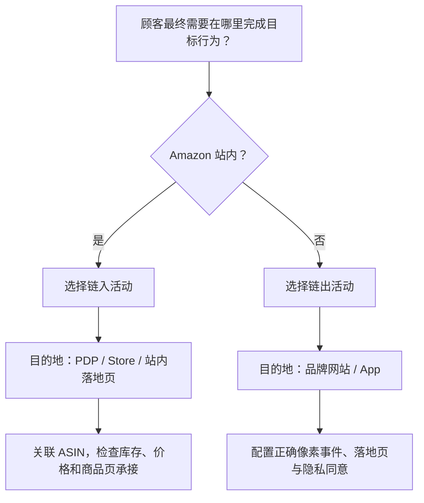

# 亚马逊DSP链入与链出广告活动逻辑

> [!summary] 摘要
> 亚马逊 DSP 的链入与链出广告活动不是按“广告展示在哪里”区分，而是按“顾客点击广告后去哪里”区分。链入广告把顾客带到 Amazon 商品详情页、品牌旗舰店或站内落地页，通常用 ASIN 和站内零售结果反馈优化；链出广告把顾客带到品牌网站或 App，通常需要像素事件衡量访问、线索或购买。

## 核心知识

### 唯一核心判断：点击后的目标位置

| 类型 | 点击后的目的地 | 典型适用对象 | 主要商业目标 |
|---|---|---|---|
| 链入广告活动 | Amazon 商品详情页、品牌旗舰店或 Amazon 站内落地页 | 在 Amazon 销售商品或服务的品牌 | 提升购买意向、商品详情页访问和站内购买 |
| 链出广告活动 | 品牌独立站、服务网站、站外落地页或 App | 不在 Amazon 销售，或必须在自有渠道完成转化的品牌 | 网站访问、线索、注册、报价申请或站外购买 |

“链入/链出”是相对 Amazon 目标位置而言：

- 链入：把顾客**带入 Amazon 零售目的地**；
- 链出：把顾客**带出 Amazon，进入广告主自有目的地**。

> [!warning] 不要用广告展示位置判断类型
> 链入广告既可以展示在 Amazon，也可以展示在第三方网站和 App；链出广告也可以展示在 Amazon 或站外流量资源。展示位置属于媒体供应问题，点击后的目的地才决定链入或链出。

### 定义

#### 链入广告活动

- 适用于在 Amazon 销售商品或服务的品牌；
- 将顾客引导到品牌的 Amazon 商品详情页或其他 Amazon 目标位置；
- 即使广告展示在第三方网站或 App，点击后仍返回 Amazon；
- 主要用于提升购买意向并推动购买。

#### 链出广告活动

- 将受众引导至品牌在 Amazon 站外的落地页；
- 课程示例包括 Amazon 不提供的服务或某品类下 Amazon 不提供的商品；
- 例如汽车品牌把正在浏览汽车相关商品的 Amazon 顾客引导到品牌网站了解新车；
- 目标行为通常发生在广告主网站，如填写表单、注册、索取报价或购买。

### 两种顾客流

#### 链入顾客流

1. 顾客访问 Amazon、第三方网站或 App；
2. 顾客看到品牌商品广告；
3. 感兴趣后点击广告；
4. 顾客到达 Amazon 商品详情页或其他站内目标位置；
5. 站内浏览、加购和购买结果成为后续衡量与优化信号。

#### 链出顾客流

1. 顾客访问 Amazon 或其他可投放媒体；
2. 顾客看到与其需求相关的品牌或服务广告；
3. 顾客点击广告；
4. 顾客打开品牌外部网站或 App；
5. 顾客填写表单、注册、索取报价或购买；
6. 像素事件把站外结果回传给广告报表和优化模型。

### 与 ASIN、像素和竞价模型的关系

两类活动使用相同的程序化筛选和竞拍机制，区别主要发生在**转化目标和反馈数据**：

| 环节 | 链入广告 | 链出广告 |
|---|---|---|
| 优化目标 | 商品详情页访问、加购、购买、ROAS 等站内结果 | 页面访问、线索、注册、报价、站外购买等 |
| 主要关联对象 | ASIN 和 Amazon 站内目标位置 | 转化像素或事件 |
| 结果发生地 | Amazon | 广告主网站或 App |
| 反馈方式 | Amazon 站内零售行为 | 网站/App 事件回传 |
| 模型学习目标 | 寻找更可能产生站内商品行为的人和展示机会 | 寻找更可能触发指定站外事件的人和展示机会 |

Amazon 当前广告规格说明：不链接到 Amazon.com 且按特定绩效目标衡量的广告单元需要集成 Amazon 像素；链接到 Amazon.com 的广告单元不适用这一像素要求。因此，不能把链出活动只设置为“外部 URL”，还必须确认目标事件能够被正确追踪。

### 业务案例

#### 案例一：鞋类商品在 Amazon 销售

品牌希望用 Amazon DSP 在 Amazon、Twitch、IMDb 和第三方媒体触达赤足鞋兴趣人群，并把订单沉淀到 Amazon。

- 类型：链入；
- 目的地：对应鞋款的 Amazon 商品详情页或 Store；
- 关联对象：ASIN；
- 主要 KPI：商品详情页访问、加购、购买、ROAS 或品牌新客；
- 模型反馈：哪些受众、创意和广告位更容易产生 Amazon 站内购买。

即使广告展示在第三方新闻网站，只要点击后进入 Amazon 商品详情页，仍然属于链入。

#### 案例二：汽车保险询价

保险公司利用 Amazon 汽车用品浏览和购买信号找到潜在车主人群，并推广保险折扣。

- 类型：链出；
- 目的地：保险公司网站的询价或登记页面；
- 关联对象：表单提交或 Lead 像素；
- 主要 KPI：页面访问、有效线索、每条线索成本；
- 模型反馈：哪些展示更可能带来表单提交。

如果只追踪网站访问而没有追踪表单提交，模型可能学会寻找“容易点击的人”，而不是“会提交保险申请的人”。

#### 案例三：同一品牌同时经营 Amazon 与独立站

不建议把两种目标混在同一活动中：

- 链入活动负责 Amazon 销售，关联 ASIN；
- 链出活动负责独立站会员、定制服务或 DTC 销售，关联对应像素；
- 分开预算、KPI、创意、落地页和归因结果；
- 再通过统一报表或 [[AMC查询用例与自动化对接方案|AMC 分析]]比较两条路径的增量价值和协同效果。

### 链入与链出的商业取舍

| 维度 | 链入广告 | 链出广告 |
|---|---|---|
| 转化摩擦 | 通常较低，顾客可使用熟悉的 Amazon 账户和购物流程 | 取决于网站速度、信任、表单长度、支付和移动端体验 |
| 衡量闭环 | Amazon 站内行为较完整 | 强依赖像素、事件设计、归因和同意管理 |
| 客户关系 | 交易主要留在 Amazon 生态 | 可在合规前提下沉淀自有客户关系和第一方数据 |
| 商品范围 | 适合 Amazon 在售商品和站内目标 | 适合站外服务、线索、DTC 商品和自有 App |
| 落地页控制 | 受 Amazon PDP、Store 和政策约束 | 品牌对页面、表单和转化流程控制更强 |
| 主要风险 | 商品页转化弱、价格/评价竞争、库存和 Buy Box 问题 | 页面体验差、像素失效、事件选错、隐私合规和归因缺口 |

### 当前资格表述的边界

课程 JSON 中写有“亚马逊只批准部分广告活动采用链出方式”，并以 Amazon 不提供的商品或服务为例。该课件生成于较早版本，不能把示例理解为今天永久不变的封闭白名单。

Amazon 当前公开资料明确说明：

- 不在 Amazon 商店销售商品的企业也可以使用展示广告和 Amazon DSP；
- 汽车、保险、教育、房地产、旅游等服务行业均有站外获客场景；
- 顾客点击展示广告后可以进入 Amazon 商品详情页，也可以进入外部自定义落地页；
- 实际可用性仍受国家/地区、账户、广告格式、品类和广告审核政策影响。

因此，创建链出活动前应以当前账户后台和最新广告政策为准，不应只依据课程中的历史资格示例。

### 选择决策树

### 上线与诊断清单

#### 链入

- 目的地是否为正确站点、正确 ASIN、正确父子变体或 Store 页面；
- 商品是否有库存、可购买、价格和 Buy Box 是否正常；
- 广告承诺与商品详情页内容是否一致；
- 目标 KPI 是否与站内购买阶段匹配；
- 报表是否能按 ASIN、创意、受众和供应来源回看表现。

#### 链出

- 外部 URL、域名和移动端落地页是否正常；
- 页面加载速度、表单长度和 CTA 是否影响转化；
- 像素是否在正确事件触发，而不是只在页面加载时误触发；
- Goal KPI 是否对应真实商业结果；
- 是否满足广告审核、隐私、Cookie 同意和数据处理要求；
- 是否将无效、重复或测试事件从正式优化数据中排除。

## 关联

- [[利用DSP广告打造流量闭环-视频转录与案例分析]]
- [[初识亚马逊DSP-视频转录与关键帧分析]]
- [[亚马逊DSP模型预测竞价与程序化竞拍逻辑]]
- [[亚马逊广告营销优化规划方案与学习路径]]
- [[AMC查询用例与自动化对接方案]]
- [[亚马逊创建广告活动模块教学]]

## 来源

- [Amazon Ads Academy：广告活动类型](https://advertising.amazon.com/academy/academy-assets/resource_target/66b3ac39-f36c-4686-96c7-88535ba4fad3/index.html#/page/65407c120c7243f0d99f04d7)
- [课程完整组件 JSON](https://advertising.amazon.com/academy/academy-assets/resource_target/66b3ac39-f36c-4686-96c7-88535ba4fad3/course/en/components.json)
- [Amazon Ads：不在 Amazon 商店销售商品时如何使用展示广告](https://advertising.amazon.com/library/guides/display-ads-beyond-amazon)
- [Amazon Ads：Display ads](https://advertising.amazon.com/products/display-ads)
- [Amazon Ads：Amazon DSP](https://advertising.amazon.com/solutions/products/amazon-dsp)
- [Amazon DSP 桌面和移动网页静态展示广告规格](https://advertising.amazon.com/resources/ad-specs/dsp/desktop)
