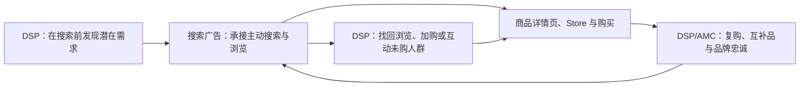

# 利用DSP广告打造流量闭环-视频转录与案例分析

> [!summary] 摘要
> 本页依据 Amazon Ads Academy《利用DSP广告打造流量闭环》51 分 04 秒视频的音频识别、4K 课件关键帧和课程元数据整理。课程的核心不是“用 DSP 替代搜索广告”，而是让 DSP 在搜索发生前扩大认知、在浏览后找回流失人群、在购买后推动复购，再由商品推广、品牌推广等搜索广告承接当下的主动需求。课程由卖家讲师主讲，预算比例、历史提升数字和部分产品表述属于 2023 年案例口径，不能视为 Amazon 官方保证或当前固定规则。

## 核心知识

### 一句话理解“流量闭环”

所谓流量闭环，是把消费者在**尚未搜索、开始搜索、比较商品、浏览未购、购买和复购**等阶段产生的信号连接起来，并为每个阶段安排不同的受众、广告产品、素材、落地页和 KPI：

闭环不等于每位顾客都会沿固定路线行进，也不等于平台能识别所有跨设备行为。它更准确的含义是：

- 用不同阶段的受众和广告产品减少流量断点；
- 把曝光、搜索、浏览、加购和购买反馈用于后续定向与优化；
- 通过回溯窗口、包含/排除、频次和归因规则控制重复触达；
- 用分阶段 KPI 判断广告是在创造需求、承接需求，还是找回流失需求。

### DSP 与搜索广告的分工

| 广告产品 | 课程中的主要角色 | 更适合解决的问题 | 不应被误解为 |
|---|---|---|---|
| 商品推广（SP） | 获取曝光和搜索流量、推动销售 | 承接关键词、商品和类目中的明确购买意图 | 只要投放就一定提升自然排名 |
| 品牌推广（SB/SBV） | 建立品牌形象、用视频和 Store 承接品牌需求 | 品牌词防御、品牌故事、组合商品与旗舰店导流 | 只能用于上层漏斗 |
| 展示型推广（SD） | 站内外展示、商品/受众定向和再营销 | 以较低操作门槛覆盖展示与再营销场景 | DSP 的完全等价替代品 |
| Amazon DSP | 程序化购买、跨资源触达、自定义受众和多维优化 | 搜索前触达、跨渠道展示/视频、受众组合、再营销和全流域衡量 | 一个固定的“网站名单”或只按 eCPM 计费的广告位集合 |

Amazon 当前官方指南将 Amazon DSP 定位为以受众为中心的全渠道程序化解决方案，而搜索广告更适合在 Amazon 站内承接高意图搜索和浏览。两者组合，才构成从需求创造到需求收割的连续方案。

> [!warning] 因果边界
> 课程中“搜索广告提高关键词排名”“DSP 降低 CPC/ACOS”等说法应理解为讲师经验或历史样本中的相关结果。广告可能通过销量、品牌搜索和转化表现间接影响零售结果，但不能把投放动作直接写成固定排名公式或效果保证。

![[亚马逊DSP流量闭环-展示广告核心优势.jpg]]

### 为什么课程把 DSP 称为“进阶版 SD”

这是讲师为便于理解所用的类比，指 DSP 在展示广告基础上增加了更多可控制维度：

1. **受众组合**：可按浏览、购买、品牌、竞品和时间窗口建立包含、排除、交集或并集；
2. **供应来源**：按 Amazon 自有自营、直接出版商和第三方供应来源查看与优化；
3. **广告位与格式**：比较不同尺寸、版位、设备和素材的表现；
4. **渠道**：网页、App、电脑、移动端、视频、流媒体电视等；
5. **可见度**：查看 viewability，并在触达质量与流量规模之间权衡；
6. **目标优化**：按点击、详情页浏览、转化、ROAS 等目标启用自动优化；
7. **竞价与预算**：依据效果、赢得率、投放节奏和目标调整；
8. **频次**：限制一定时间内同一受众看到广告的次数；
9. **素材**：按受众、版位和素材报告做 A/B 测试；
10. **分时预算**：根据历史高价值时段调整投放。

![[亚马逊DSP流量闭环-多维数据优化.jpg]]

这些控制项并不是彼此独立的。例如，提高可见度要求可能缩小流量并抬高价格；扩大回溯周期可能增加触达，却稀释意向；增加频次可能强化记忆，也可能造成疲劳。最终竞价仍受 [[亚马逊DSP模型预测竞价与程序化竞拍逻辑|DSP 的预测、预算和竞拍逻辑]]共同影响。

### 自定义受众：闭环的连接器

课程用风扇说明“浏览未购”组合：

1. 建立过去 30 天浏览过相关风扇或竞品的人群；
2. 排除已购买本品、品牌或竞品的人群；
3. 对剩余的高考虑人群投放再营销；
4. 根据价格、决策周期和促销节奏缩短或延长回溯窗口。

![[亚马逊DSP流量闭环-自定义受众.jpg]]

回溯窗口不能机械套用：

| 商品特征 | 课程建议方向 | 应验证的实际信号 |
|---|---|---|
| 低价、短决策周期 | 7–14 天浏览未购 | 转化延迟、频次、边际 CPA |
| 一般耐用品 | 约 30 天 | 浏览到购买的实际分布 |
| 高价、长决策周期 | 45–60 天或更长 | 是否仍有增量、是否人群过宽 |
| 猫粮、耗材等高复购 | 按补货周期建立购买人群 | 首购到复购的天数分布 |
| 大促活动 | 可适度延长窗口 | 更久意向人群是否被折扣重新激活 |

课程把 IMDb、Twitch 等作为内容和流量示例。实际供应来源、可用受众、广告格式和国家/地区资格必须以当前账户为准，不能把讲师口播中出现的网站或社交平台名称当作 Amazon DSP 的永久库存清单。

### 供应来源、广告位和受众报告如何用于优化

![[亚马逊DSP流量闭环-供应来源优化.jpg]]

课程展示了三类常用诊断：

- **供应来源报告**：比较每个来源的花费、展示、点击、eCPM、CTR、DPVR、加购、购买、销售和 Total ROAS；扩大有效来源，限制低质量来源；
- **广告位报告**：判断具体尺寸、位置和设备是否真正带来详情页浏览或购买，而不是只产生便宜曝光；
- **受众表现报告**：按点击、DPV、购买和转化率发现潜在人群，再建立独立测试或与其他条件取交集。

> [!note] 不要只凭 Total ROAS 删除来源
> 上层漏斗来源可能先贡献触达和品牌搜索，下层来源才获得末次转化。应同时看广告活动目标、路径位置、触达去重、详情页浏览、品牌新客和归因窗口；否则容易把“创造需求”的来源误判为无效。

### 受众重叠报告与 AMC

课程用植物架购买者举例：把“过去购买过花架的人群”与其他 Amazon 受众比较，观察重叠率、预测日触达和 affinity，再验证哪些生活方式或意向标签值得测试。

![[亚马逊DSP流量闭环-受众重叠报告.jpg]]

重叠高只代表两个群体关系密切，不自动等于广告会高转化。它更适合用于：

- 发现可能相关的兴趣、生活方式和细分类目；
- 检查当前品类或受众假设是否合理；
- 为扩量人群生成待测试清单；
- 设计包含、排除和去重方案。

课程还把 AMC 视为连接广告互动与 DSP 激活的工具，可构建例如：

- 点击商品推广但未购买；
- 加入购物车但未购买；
- 看过认知广告但未看过转化广告；
- 多次浏览详情页但未购买；
- 看过或点击广告、随后搜索相关词但未购买；
- 品牌新客、愿望清单未购、购买 A 未购买 B；
- 高价值或高复购倾向人群。

![[亚马逊DSP流量闭环-AMC高意向受众.jpg]]

AMC 人群是否可创建、可激活以及最小人群规模等要求会随账户、地区和产品能力变化。执行时应以当前 AMC 与 DSP 界面为准，详细方法见 [[AMC查询用例与自动化对接方案]]。

## 四阶段流量闭环

![[亚马逊DSP流量闭环-四阶段策略矩阵.jpg]]

| 阶段 | 目标 | 课程中的典型人群/策略 | 素材 | 核心衡量 |
|---|---|---|---|---|
| 认知 | 让相关人群认识品牌 | In-market、生活方式、生活事件、兴趣、人口统计 | 品牌视频、自定义图片、自动生成素材 | 去重触达、频次、可见曝光、视频观看、品牌搜索 |
| 考虑 | 从品类和竞品中拉新引流 | 竞品 ASIN 浏览、上下文相关、AMC 高考虑人群，排除已购 | 差异化图片/视频、功能和价格对比信息 | DPVR、每次详情页浏览成本、互动、品牌新客 |
| 转化 | 找回高意向流失人群 | 本品/品牌浏览再营销、加购未购、愿望清单未购、AMC 高意向人群 | 商品、优惠、评价与明确 CTA | 购买、CPA、ROAS、增量转化 |
| 忠诚 | 复购、互补品和品牌黏性 | 已购买本品/品牌、购买 A 未买 B、高价值顾客 | 补货、组合装、互补品、新品和 Store | 复购率、重复购买 ROAS、顾客终身价值 |

“认知阶段只能用 DSP”“忠诚阶段只能用 DSP”是课程为了简化矩阵的表达，不是绝对产品边界。更严谨的做法是：先按目标与受众状态选择最适合的广告产品，再检查当前账户实际支持的广告格式、定向和衡量方式。

## DSP 与搜索广告的阶段协同

![[亚马逊DSP流量闭环-DSP搜索广告考虑阶段协同.jpg]]

### 认知阶段

- DSP：在顾客尚未主动搜索时，用市场意向、生活方式、兴趣、生活事件和视频触达；
- 搜索广告：此时不是主要发现工具，但可通过品牌词和相关品类词承接被激发后的搜索。

### 考虑阶段

- DSP：覆盖过去浏览竞品未购、上下文相关和 AMC 高考虑人群；
- SP/SB/SBV：承接当前正在搜索关键词、浏览类目或竞品详情页的人；
- 协同重点：DSP 带来新增考虑人群，搜索广告保证其返回 Amazon 搜索和详情页时仍能看到品牌。

### 转化阶段

- DSP：浏览再营销、加购未购、愿望清单未购和品牌浏览未购；
- SP/SB：品牌词防御、商品定投、Store 或 PDP 承接；
- 协同重点：避免 DSP 把人带回后，搜索结果页和 PDP 又被竞品截流。

### 忠诚阶段

- DSP/AMC：复购、互补购买、高价值顾客与购买 A 未买 B；
- 搜索广告：承接顾客主动补货、查找品牌和比较新品时的需求；
- 协同重点：控制排除与频次，避免把本来会自然复购的人全部归因给广告。

## 耳机品牌案例

课程描述一家国内已有市场基础、希望进入美国站的头戴式耳机工厂型卖家：

- 痛点一：新品冷启动困难，需要快速获得流量；
- 痛点二：竞品广告占据产品详情页流量，需要品牌防御并寻找反向突破；
- 认知期：用 in-market 等人群和品牌素材先建立认知；
- 考虑期：投放竞品浏览未购与上下文相关人群，优先选择功能或价格上可形成差异的竞品；
- 转化期：找回浏览本品/品牌未购人群，以 ROAS 为主要优化方向；
- 忠诚期：耳机本身复购较低，因此案例没有强行套用复购策略；
- 中后期：积累评论后扩大竞品和人群范围，配合站内广告与活动；
- 旺季：根据人群画像扩大投放，课件称黑五网一期间一款产品进入小类前三，多款产品进入小类前 50。

![[亚马逊DSP流量闭环-耳机案例结果.jpg]]

> [!warning] 案例不能证明单一因果
> 排名结果同时受到评论积累、站内广告、促销、价格、库存、自然需求和多个产品矩阵影响。课程没有提供对照组、完整预算、利润、增量测试或归因拆分，因此只能把它视为“如何组织打法”的案例，不能把排名提升全部归因于 DSP。

## 课程中的历史效果数字

![[亚马逊DSP流量闭环-展示搜索协同历史数据.jpg]]

| 课程/课件中的结果 | 原始语境 | 正确使用方式 |
|---|---|---|
| 搜索关键词指标 +12%、曝光 +50% | 课件称投放展示广告四周后的 CPC 广告变化 | 说明可观察搜索与展示协同，不作为未来活动目标 |
| CPM 单次曝光 -24%、CPC 单次点击 -17% | 同一历史研究画面 | 需要核对样本、定义和归因；不能证明必然降本 |
| CPC 下降 47%、每订单广告花费下降约 73% | 另一课件画面比较展示广告上线前后 | 属于前后对比，可能受季节、竞价和零售变化影响 |
| 墨盒品牌复购率高出对标 7.5 个百分点 | 对过去购买人群投放复购策略 | 适合说明耗材补货逻辑，不应迁移到低复购耐用品 |
| 耳机旺季一款进入小类前三、多款进入前 50 | 卖家合作案例 | 缺少对照和完整经营变量，仅作案例线索 |

其中展示与搜索协同画面脚注指向 2019 年 3–5 月对 7 个类目、18 个广告主的监测样本。旧年份、有限样本和多市场混合意味着这些数字只能用于提出分析问题，不能作为 2026 年账户的效果承诺。

## 预算建议：保留课程原貌，但不直接照搬

![[亚马逊DSP流量闭环-策略预算建议.jpg]]

| 讲师分类 | 课程建议的阶段分配 | 课程建议的 DSP 预算 |
|---|---|---|
| 激进型新卖家—潜力新品 | 认知 20% / 考虑 60% / 转化与忠诚 20% | 销售目标的 5%–10% |
| 激进型新卖家—品牌出海 | 认知 50% / 考虑 30% / 转化与忠诚 20% | 销售目标的 5%–10% |
| 激进型老卖家 | 认知 30% / 考虑 40% / 转化与忠诚 30% | 自助式广告预算的约 1/2–1/3 |
| 保守型新卖家 | 考虑 40% / 转化与忠诚 60% | 销售目标的 1%–5% |
| 保守型老卖家 | 考虑 40% / 转化与忠诚 60% | 自助式广告预算的 1/3 及以下 |

课程另提到月销售额 30 万美元、增长目标超过 50% 等适投判断。这些是讲师的客户筛选和规划启发式，不是 Amazon DSP 的官方资格、最低销售额或通用财务标准。

更稳健的预算方法是：

1. 先确定增量销售、品牌新客、触达或复购等业务目标；
2. 用毛利、可承受 CPA、历史转化率和受众规模反推测试预算；
3. 为认知、考虑、转化分别设定 KPI，避免一个订单项同时承担所有目标；
4. 预留对照或未曝光人群，判断真实增量；
5. 达到最低数据量后，按边际 ROAS/CPA 和频次重新分配；
6. 不以“预算花完”作为成功标准。

## 旺季三阶段打法

### 大促前：预热与蓄水

![[亚马逊DSP流量闭环-旺季预热引流.jpg]]

搜索广告：

- 根据历史数据补充高表现关键词和 ASIN；
- 复核曾暂停或归档的相关词，而不是无条件全部恢复；
- 否定真正无关词根；
- 提前设置预算和竞价规则，并检查库存、促销与落地页。

DSP：

- 用流媒体电视、在线视频和品牌素材扩大认知；
- 增加市场意向、生活方式、兴趣和生活事件受众；
- 在可控范围内提高频次，防止过度曝光；
- 根据决策周期适当延长浏览和竞品人群回溯窗口；
- 提前积累可用于再营销的有效受众。

### 大促中：放量、再营销和转化

搜索广告：

- 对高转化活动提高预算和竞价，但不机械“翻倍”；
- 可建立旺季专用活动或分组，避免污染常规基线；
- 当竞品折扣显著强于本品时，调整竞品定向，减少无效消耗；
- 持续检查预算断档、Buy Box、库存和落地页转化。

DSP：

- 提高有效订单项的预算、竞价和可接受频次；
- 用上下文相关定向承接正在浏览类目/竞品的人群；
- 加强浏览、加购和互动未购再营销；
- 监控边际成本，不因旺季流量大就放弃频次和增量判断。

### 大促后：返场、降速和复盘

- 搜索广告逐步下调临时提高的预算与竞价，恢复长期结构；
- DSP 用返场素材、组合品和互补品承接未赶上大促及已购人群；
- 排除不需要继续追投的已购人群；
- 做同比与活动前后复盘，但同时控制促销、价格、库存和自然需求差异；
- 把本次高价值受众、关键词、素材和路径结果沉淀到下一次活动。

## 时效与口径校正

| 课程表述 | 2026 年使用时的处理 |
|---|---|
| “DSP 不能自助投放，只能通过 Amazon 或第三方服务商” | 已过时。Amazon 当前公开指南说明同时提供自助式和托管式 DSP；具体开放资格以地区和账户为准 |
| “DSP 就是一个超大网站合集” | 仅是教学类比。DSP 是程序化媒体购买、受众、竞价、素材、衡量和报告平台，不只是网站清单 |
| 口播列举 Facebook、Instagram 等站外名称 | 不能据此认定这些资源可通过 Amazon DSP 购买；以当前供应来源和官方库存说明为准 |
| “DSP 按 eCPM 计费” | 过度简化。当前 DSP 支持实时竞价、PMP、程序化保量/固定 CPM 等不同购买方式，定价还可能包含服务或可选功能费用 |
| “DSP 视频目前只支持站外” | 属于课程当时口径。当前 Amazon DSP 覆盖 Prime Video、Twitch、流媒体电视、在线视频及其他符合条件的资源 |
| “DSP 是唯一贯穿整个购买旅程的广告” | 应理解为强调 DSP 的全流域能力；其他 Amazon 广告产品也可在多个阶段协同发挥作用 |
| 预算比例、月销售门槛、效果数字 | 全部属于卖家讲师经验或历史案例，不是 Amazon 官方规则和保证 |

## 时间轴式校订转录

> [!note] 转录说明
> 下列内容由高精度中文语音识别后，结合 4K 课件画面校订，是结构化知识摘要而非逐字稿。机器识别中的 “ASAN、TotalOS、Vivability、中程阶段”等已按画面和语义校正为 ASIN、Total ROAS、viewability、忠诚阶段。

| 时间 | 主题 | 校订后的要点 |
|---|---|---|
| 00:00–01:28 | 讲师背景 | 卖家讲师介绍自身 DSP 与站内广告代投经历；所有成绩属于讲师自述 |
| 01:28–06:21 | 主流广告工具 | 比较 SP、SB、SD 与 DSP 的目标、触达方式、广告位和优化维度 |
| 06:21–09:48 | 展示广告与 SD | 成本、再营销、认知种草；介绍 SD 的商品/受众投放和基础优化 |
| 09:48–12:39 | DSP 自定义受众 | 用浏览、未购、竞品、回溯窗口及内容兴趣组合更细的人群 |
| 12:39–16:32 | 供应与广告位 | 按供应来源、站内外流量、广告位置和人群表现精细优化 |
| 16:32–19:56 | 重叠与多维优化 | 受众重叠、affinity、渠道、viewability、KPI、竞价、频次、素材和分时预算 |
| 19:56–22:25 | 历史效果案例 | 展示与搜索协同、CPC/CPM/订单成本变化及墨盒复购案例 |
| 22:25–25:29 | AMC 与整合营销 | 构建点击未购、加购未购、曝光未转化等高意向受众，强调广告产品整合 |
| 25:29–28:36 | 四阶段闭环 | 认知、考虑、转化、忠诚的目标、人群、定向和素材 |
| 28:36–37:59 | 耳机品牌案例 | 从冷启动、竞品防御、再营销到旺季扩量的阶段性方案与结果 |
| 37:59–42:00 | 适投与预算 | 按增长风格、新老卖家和阶段分配预算；均为讲师建议 |
| 42:00–46:58 | DSP + 搜索广告 | 按认知、考虑、转化和忠诚安排 DSP、SP、SB、SBV 等产品 |
| 46:58–51:04 | 旺季三阶段 | 大促前预热、大促中放量与再营销、大促后返场和复盘 |

## 从课程到实际投放的检查清单

1. 先定义业务目标，再选择广告产品，不从“我要投 DSP”倒推目标；
2. 把认知、考虑、转化和忠诚拆成不同订单项与 KPI；
3. 关联正确 ASIN 或转化事件，链出场景检查像素和隐私同意；
4. 为浏览未购、加购未购、已购和竞品人群设置明确包含/排除；
5. 回溯窗口以真实转化延迟和复购周期为依据；
6. 同时检查受众、供应来源、广告位、渠道、素材、频次和可见度；
7. 搜索广告负责承接主动需求，DSP 负责扩展、找回和跨阶段连接；
8. 旺季前建立基线，大促中按边际效果放量，大促后及时降速；
9. 历史案例数字只用于提出假设，使用自己的对照与增量结果决策；
10. 所有产品资格、库存、受众和购买方式以当前账户及官方规则为准。

## 关联

- [[初识亚马逊DSP-视频转录与关键帧分析]]
- [[亚马逊DSP模型预测竞价与程序化竞拍逻辑]]
- [[亚马逊DSP链入与链出广告活动逻辑]]
- [[AMC查询用例与自动化对接方案]]
- [[亚马逊广告营销优化规划方案与学习路径]]

## 来源

- [Amazon Ads Academy：利用DSP广告打造流量闭环](https://advertising.amazon.com/academy/student/path/36991/activity/55787?activeLocale=zh-cn)
- [课程公开视频文件](https://d1apxakas9uxdu.cloudfront.net/uploads/55787/files/a9ad5c0e-e365-4e4c-a885-39239760e72adsp-jojo.mp4)
- [Amazon Ads：需求方平台完整指南](https://advertising.amazon.com/zh-cn/library/guides/demand-side-platform)
- [Amazon Ads：Amazon DSP 产品页](https://advertising.amazon.com/solutions/products/amazon-dsp)
- [Amazon Ads：营销漏斗指南](https://advertising.amazon.com/zh-cn/library/guides/marketing-funnel)
- 课程页面公开 `CHILD_COURSE_INITIAL_DATA`、51:04 中文音频识别与 4K 关键帧校对，处理日期：2026-07-30
